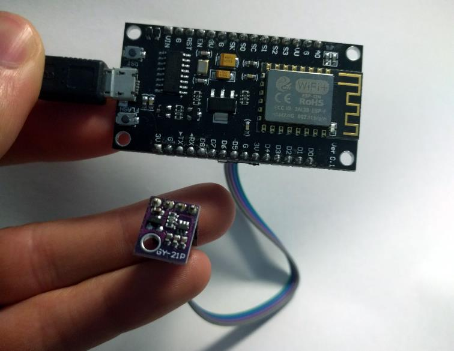

# ESP8266 MQTT Sensor Node



This simple project turns an [ESP8266](http://espressif.com/en/products/hardware/esp8266ex/overview)
WiFi chipset running [MicroPython](https://micropython.org/) into a simple
sensor node, periodically sampling one or more sensors and sending the data to a
MQTT broker (e.g. [Mosquitto](https://projects.eclipse.org/projects/technology.mosquitto)).

I use several of these nodes around my house to monitor various environmental
parameters (temperature, humidity, etc.) which is then passed to my server
running the [HomeAssistant](http://home-assistant.io/) home automation software.

## Dependencies

You will need to have a Python 3.x installed on the host system. The following
Python libraries are required, and will be installed by running `make setup`:

```
adafruit-ampy
esptool
```

Tested on Windows, however this should work on other platforms too (since the
flashing tools are all Python based).

## Hardware

An ESP8266 board is required - I'm using a [NodeMCU](https://en.wikipedia.org/wiki/NodeMCU)
clone board, since they're absurdly cheap on eBay. Any module with at least 1MB
of flash should be fine.

You will need to connect one or more sensors to the board, typically via I2C.
See the `src/sensors/` directory for supported sensors.

## Status

Working and stable, although I've only included a few sensor drivers. Patches
welcome.

## Use

Connect your sensors to your board, and connect your board to the PC via a
serial port (NodeMCU modules include a USB-to-Serial bridge IC).

1) Install MicroPython onto the board (replace `COM5` with the path to the
appropriate serial port the board is connected to):
```
make bootstrap COM_PORT=COM5
```

You will need to reset the board once MicroPython is installed - this is usually
just a case of pressing the board's RESET button, or shorting a RST pin to GND..

2) Copy the existing `src/config.default.py` to `src/config.py`, and edit it to
suit your own setup (documentation on the configuration format is included in
the [default config file](src/config.default.py)).

3) Install the application and configuration onto the module:
```
make flash COM_PORT=COM5
```

You can reflash the application only - the initial bootstrapping to install
MicroPython is once off unless you are flashing a newer MicroPython release.

## License

Released into the public domain - this builds on so much community work and it's
so simple anything else would be a virtual crime.
